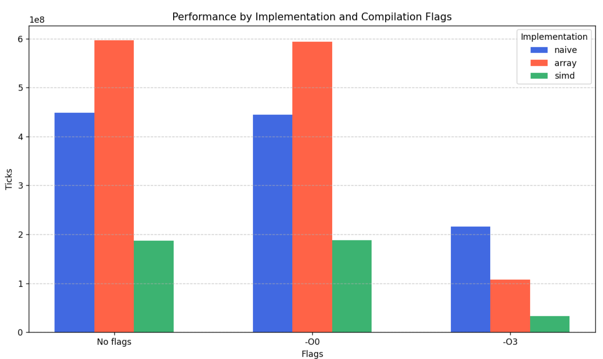
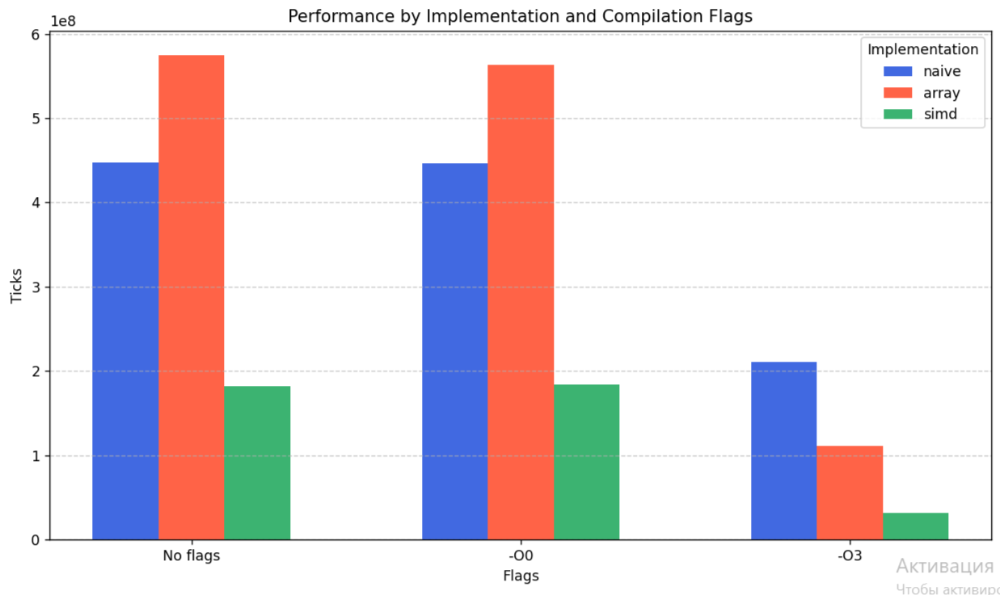
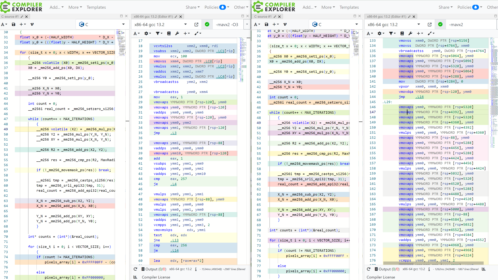

# Множество Мандельброта
## Описание проекта
В данном проекте было осуществлено сравнение различных алгоримтов построения множества Мандельброта (подробнее о нем ниже).

### Цель работы
Измерить скорость вычисления множества Мандельброта, используя 3 типа вычислений:
* "наивный" - вычисление, считающее цвет одного пикселя за одну итерацию цикла;
* "векторизированный" - оптимизация вычислений за счёт обработки нескольких точек одновременно
* SIMD-оптимизация (AVX2) — ускорение расчётов с использованием векторных инструкций процессора.

## Множество Мандельброта
Координаты точек множества Мандельброта удовлетворяют следующим уравнениям:
1) $x_{n+1}$ = $x_n^2 - y_n^2 + x_0$
2) $y_{n+1}$ = $2 * x_n * y_n + y_0$,

где (x0, y0) - координаты рассчитываемого пикселя.  

Цвет пикселя изображения зависит от количества итераций (`MAX_ITERATIONS = 256`), при которых точка находится внутри окружности данного радиуса (`MAX_RADIUS = 10`). Важно отметить, что, если точка отдалилась от центра окружности на расстояние большее, чем ее радиус, то дальше она будет удаляться в "бесконечность".

  

Таким образом, можно легко отследить области, в которых точка не вышла за пределы окружности (черный цвет) и наоборот (не черный цвет).

## Особенности и запуск программы
### Особенности
В данном проекте отлажено два режима работы:
1) **Графический режим**: открывается графическое окно размером `800x600`, в котором визуализировано множество Мандельброта. В левом верхнем углу показывается FPS. Также поддерживается перемещение и изменение масштаба фигуры.
 
Горячие клавиши:
  
|   Клавиша   |   Действие    |
|------------:|:--------------|
| ?           | Сдвиг вверх   |
| ?           | Сдвиг вниз    |
| ?           | Сдвиг влево   |
| ?           | Сдвиг вправо  |
| =           | Приближение   |
| -           |  Удаление     |  

2) **Тестовый режим**: запускается цикл расчета 80 кадров. Полученное значение делиться на количество итераций (80). В стандартный вывод печатается затраченное время расчета одного кадра, либо в секундах, либо в тиках процессора
в зависимости от режима измерения, выбранного пользователем.

В программе реализованы три различных метода построения данного фрактала:
  - **Naive** - обработка отдельно каждого пикселя.
  - **Array** - обработка за 1 итерацию цикла массива из 8 пикселей.
  - **Simd**  - обработка за 1 итерацию цикла 8 пикселей c использованием AVX инструкций, что позволяет добиться большей оптимизации.

### Запуск
Для того, чтобы собрать проект, нужно ввести команду:
```bash
make
```

Далее нужно вписать название `*.exe` файла и после него указать аргументы командной строки.  

Для того, чтобы запустить графическую реализацию нужно указать, какой метод построения вы хотите использовать (1 - `Naive`, 2 - `Array`, 3 - `Simd`).   

Пример запуска графической "наивной" реализации:
```bash
./mandle.exe 1  
```
  
Для того, чтобы запустить тестовую реализацию нужно указать дополнительный аргумент командной строки, который отвечает за то, в чем вы хотите получить результат (0 - `seconds`, 1 - `ticks`).  

Пример запуска тестовой "наивной" реализации с результатом в тиках процессора:
```bash
./mandle.exe 1 1
```
### Системные спецификации

Процессор: 12th Gen Intel(R) Core(TM) i5-1200H, 2500 МГц, 12 ядер, 16 логических процессоров.

Компилятор: gcc 13.3.0 & clang 18

ОC: Ubuntu WSL2

# Первая версия 
### Базовое вычисление множества Мандельброта
Измерение расчета 1 кадра мы будем получать в тактах процессора, используя функцию `__rdtsc()`. Данный метод является достаточно точным, поскольку `__rdtsc()` раскрывается в отдельную ассемблерную инструкцию (ее погрешность не превышает нескольких десятков тактов). Основную погрешность в измерения будут вносить прерывания, вызванные работой других процессов.   

Данные были получены для каждой версии алгоритма с каждым из уровней оптимизации:
 - **-O0**: оптимизация кода не производится. Исходный текст программы тривиальными преобразованиями перерабатывается в машинный код. Благодаря этому уменьшается время компиляции программы.
 - **-O3**: обычно применяются все доступные компилятору способы оптимизации.
 - **No flag**: также были получены данные при запуске программы без применения этих флагов.
  
### Обработка результатов
Для каждой серии измерений данные находятся в [таблице](data.md). Здесь будут усредненные значения, для нас они являются более важными.  

| Type\Flag       | No flags     |    -O0     |    -O3     |
|----------------:|:------------:|:----------:|:-----------|
|Naive on GCC           | 448836152    | 444215145  | 215564328  |
|Array on GCC          | 596859921   | 593526982 | 107144019  |
|Simd on GCC            | 186629892    | 188514684  | 32862219   |  
|                       |              |             |           |
|Naive on Clang         |  447153636   | 446413405   | 210385565 |
|Array on Clang         |  575038952   | 563470040   | 111039172 |
|Simd on Clang          |  182377834   |  183862717  | 31841715  |


Для лучшего понимания визуализируем данные результаты с помощью гистограммы.
 

Также для Clang 
 

## Результаты тестирования производительности базовй версии
### Ключевые наблюдения

1. **Эффективность оптимизации -O3**  
   Все методы вычислений демонстрируют значительное ускорение при компиляции с флагом `-O3`:  
   - Ускорение в **2.0-5.8?** по сравнению с `-O0`  
   - Наибольший прирост производительности наблюдается у SIMD on Clang (прирост производительности относительно No flags в 5.8 раз)
2. **Максимальная производительность (-O3)**  
   SIMD on GCC:         32.8 млн тактов (6.5? быстрее Naive)
   Vectorized on GCC:   107.1 млн тактов (2.0? быстрее Naive)
   Naive on GCC:        215.5 млн тактов (базовая скорость)

   SIMD on clag:        31.8 млн тактов (6.6x быстрее Naive)
   Vectorized on Clang: 111.0 млн тактов (1.9x быстрее Naive)
   Naive on Clang:      210.3 млн тактов (базовая скорост)
3. **Сравнение компиляторов**
   
   | Метод       | GCC (-O3) | Clang (-O3) | Разница |
   |-------------|----------|------------|---------|
   | Naive       | 215.5M   | 210.3M     | +2.5%   |
   | Vectorized  | 107.1M   | 111.0M     | -3.5%   |
   | SIMD        | 32.8M    | 31.8M      | +3.1%   |

   Clang показывает marginally лучшие результаты для SIMD (+3.1%), GCC лучше оптимизирует векторную версию.


### Почему без -O3 работает дольше?
Воспользуемся **Godbolt** и посмотрим, во что раскрывается функция c интринсиками с флагом -O3 и без него. Мы видим, что справа (версия без -O3) раскрывается в большое количество инструкций, а точнее использование `vmovaps`, так как задействуется меньшее количество регистров. А версия слева (версия с -O3) наоборот. Поэтому мы и получаем меньшее количество тактов процессора с флагом -O3.


# Вторая версия
## Оптимизация производительности через увеличение размера вектора

Изначально в проекте использовался размер вектора **8 элементов**, что соответствует:
- 256-битным регистрам AVX2 (ровно 8 float-значений)
- Естественному выравниванию для большинства SIMD-инструкций

**Наша задача — зарефакторить код так, чтобы компилятор увидел векторизацию**

**Проблема**: Компилятор (GCC/Clang) не применял агрессивные оптимизации, потому что:
```
float X0[8]; // Компилятор рассматривал как отдельный вектор
float X1[8]; // Без анализа межвекторных зависимостей
```

Эксперимент с ```VECTOR_SIZE = 32```

Вместо векторного сложения и умножения, разжуем компилятору сложения массивов независимыми циклами

### ```On GCC```


  | Type\Flag       |    -O0       |    -O3     |
|----------------:|:------------:|:----------:|
|Array on GCC         | 780228580 | 39062525  |
|Simd on GCC          | 169272774  | 33721441 | 

> [!NOTE]
> Чтобы можно было отслеживать где компилятор оптимизировал код, то можно воспользоваться флагом ```-fopt-info-vec```

### ```On Clang```

| Type\Flag       |    -O0       |    -O3     |
|----------------:|:------------:|:----------:|
|Array on Clang        | 851709858 | 91598302  |
|Simd on Clang         | 161623396  | 34310658 | 

## Промежеточный результат 
**GCC** 
  - Array при флаге O0 производительость ухушилась в 0.7 раз, НО при флаге O3 скорость выросла в 2.7 раз
  - Simd при флаге O0 производительность улучшилась в 3.5 раз, НО при флаге O3 скорость снижилась в 0.97 раз

**Clang**
  - Array при флаге O0 производительность ухудшилась в 0.7 раз, НО при флаге O3 скорость выросла в 1.2 раза
  - Simd при флаге O0 производительность улучшилась в 1.2 раза, НО при флаге O3 скорость снизилась в 0.95 раз

** Примечание **

Все резальтаты сравнивалиьс с первой версией

## Почему так получилось 

**Для Array (mandelbrot_vectorized):**

```O0```

- Ухудшение:
    - Компилятор не оптимизирует код
    - Увеличивается объем работы в каждом цикле (в 4 раза больше элементов)
    - Нагрузка на кэш-память возрастает, но без оптимизаций это не компенсируется

 ```O3```

- Улучшение благодаря
    - Лучшему использованию кэша (большая плотность вычислений)
    - Уменьшению накладных расходов на циклы (больше работы за итерацию)
 
**Для SIMD(mandelbrot_simd):**

```O0```

- Улучшение потому что:
  - Даже без оптимизаций, обработка 32 элементов вместо 8 лучше использует аппаратные возможности
  - Уменьшается количество итераций внешнего цикла
 
```O3```

- Незначительное ухудшение объясняется
    - Перегрузкой исполнительных блоков CPU (порт saturation)
    - Проблемами с выравниванием памяти при большом VECTOR_SIZE
    - Увеличением давления на кэш-память

### Вывод по этой версии

1. Для наивной реализации:
   - VECTOR_SIZE=32 выгоден только с -O3 (?2.7x в GCC)
   
2.Для ручной SIMD-оптимизации:
   - Оптимально VECTOR_SIZE=8 (лучшая IPC)
   - Увеличение размера дает marginal выигрыш только при -O0
 
# Третия версия 
###  Ключевые изменения в реализации

```
 // 1. Выровненные массивы для вычислений
struct MandelBrot {
    alignas(32) float X0[32];
    alignas(32) float X_N[32];
    alignas(32) float Y_N[32];
    // ... остальные массивы
};

// 2. Модифицированная SIMD-обработка
void mandelbrot_simd(MandelBrot_t* set) {
    __m256i* pixels = (__m256i*)set->pixels_array;
    for (...) {
        __m256 X0 = _mm256_load_ps(&set->X0[0]); // Aligned load
        // ... вычисления ...
        _mm256_store_ps(&output[0], result); // Aligned store
    }
}
```

Вот программа в которой лежит код с выравниваем [```mandelbrot_alignment.cpp```](https://github.com/MaxGud10/Mandelbrot/blob/main/src/mandel_alig.cpp)

** Резульаты тестирования **

| Тип реализации | Компилятор | -O0 (такты) | -O3 (такты) | Отношение -O3/-O0 |
|----------------|------------|-------------|-------------|-------------------|
| Array          | GCC        | 541945398 | 105964364 | 5.11x             |
| SIMD           | GCC        | 166633068 | 32932176  | 5.06x             |
| Array          | Clang      | 559299600 | 108979561 | 5.13x             |
| SIMD           | Clang      | 158135311 | 30832159  | 5.13x             |

## Сравнительный анализ

### 1. Эффективность оптимизаций (-O3)

**Ключевые наблюдения:**
- Все реализации показывают **ускорение ~5.1x** при включении оптимизаций (-O3)
- Компиляторы демонстрируют схожую эффективность:
  - GCC: 5.06-5.11x
  - Clang: 5.13x

**Интерпретация:**

Автовекторизация работает одинаково хорошо в обоих компиляторах

### 2. Сравнение реализаций

**Array vs SIMD:**
| Метрика          | Array (-O3) | SIMD (-O3) | Преимущество SIMD |
|------------------|-------------|------------|-------------------|
| GCC              | 105.9M      | 32.9M      | 3.22x             |
| Clang            | 109.0M      | 30.8M      | 3.54x             |

**Выводы:**
- Ручная SIMD-оптимизация дает **3.2-3.5x преимущество** над векторной версией
- Разница между компиляторами незначительна ( < 10%)

### 3. Динамика изменений относительно базовой версии

**GCC:**
- **Array**:
  - -O0: +10% (1.1x)
  - -O3: без изменений (1.0x)
  
- **SIMD**:
  - -O0: +10% (1.1x)
  - -O3: -1% (0.99x)

**Clang:**
- **Array**:
  - -O0: без изменений (1.0x)
  - -O3: без изменений (1.0x)
  
- **SIMD**:
  - -O0: +20% (1.2x)
  - -O3: без изменений (1.0x)

# Четвертая версия
## Многопоточная реализация

### Ожидаемый прирост

**Характеристики** процессора
- **Ядра**: 12 физических  
- **Потоки**: 16 

**Возможный** прирост производительности
  - **Миф**: 12-кратное ускорение за счёт 12 ядер  
  - **Реальность**: Прирост зависит от типа задач и реализации многопоточности  

Современные процессоры поддерживают технологию гиперпоточности (Hyper-Threading у Intel или SMT у AMD), которая позволяет одному физическому ядру выполнять сразу два программных потока.

Основная идея гиперпоточности заключается в более эффективном использовании вычислительных ресурсов: пока один поток ждёт данные из памяти или по какой-то иной причине простаивает, второй поток может использовать свободные вычислительные блоки ядра

При полной загрузке процессора гиперпоточность может обеспечить дополнительное ускорение порядка 20–30% по сравнению с использованием только физических ядер (x7-8 в нашем случае). Но стоит готовиться к худшему — в нашем случае, когда узким местом являются арифметические операции, прирост может оказаться ниже, чем для задач, где часто возникают ожидания.

## Использование OpenMD

> [!NOTE]
> OpenMP (Open Multi-Processing) — открытый стандарт для распараллеливания программ. Даёт описание совокупности директив компилятора (#pragma ...), библиотечных процедур и переменных окружения, которые предназначены для программирования многопоточных приложений на многопроцессорных системах с общей памятью.

## Простейший способ распараллеливания
**OpenMP** предлагает минималистичный подход - достаточно одной директивы:

```
    #pragma omp parallel for
    for (size_t y = 0; y < HEIGHT; y++) 
    {
        const float base_x0 = (-(HALF_WIDTH) * D_X + set->x_offset) * set->scale;
    . . . 
```

## Критически важные условия

**Независимость итераций** - ключевое требование:
  - Ранее c_y вычислялась через инкремент (зависимость между итерациями)
  - Новая версия вычисляет координату автономно для каждого Y

## Основные типы распределения итераций

### 1. `schedule(dynamic)`
- **Принцип работы**:  
  - Динамическое распределение итераций по мере завершения потоков
  - Размер чанка (блока итераций) по умолчанию = 1
- **Преимущества**:
   - Идеален для неравномерных нагрузок
   - Автоматическая балансировка  
- **Недостатки**:
   - Дополнительные накладные расходы  

### 2. `schedule(dynamic, N)`
- **Особенности**:  
  - Фиксированный размер чанка = N итераций
  - Потоки получают блоки по 8 итераций
- **Оптимальное применение**:
    - Когда время выполнения итераций примерно одинаково  
    - Уменьшает накладные расходы vs `dynamic`  

### 3. `schedule(guided, 8)`
- **Гибридный алгоритм**:  
  - Начинает с крупных блоков ? уменьшает размер по мере выполнения
  - Минимальный размер чанка = 8 (последние блоки)
- **Преимущества**:  
  - Быстрый старт (крупные блоки)  
  - Хорошая балансировка (мелкие блоки в конце)  

## Результаты 

| Type\Flag       | Array        |   SIMD     | 
|----------------:|:------------:|:----------:|
|Dynamic          | 35954467    | 9213873  |
|Dynamic, N        | 38602703   | 9269230 | 
|Guided           | 35969664    | 8758023  |  

## Ключевые наблюдения

### 1. Сравнение методов планирования
- **Лучший результат**:  
  - Для Array: **Static** прирост в 3x относительно первой версии  
  - Для SIMD: **Guided** прирост в 3.7х относительно первой версии  


# Заключение 

## Сравним версии без оптимазции с уже оптимизированными версиями

|Реализация|Результат, Ticks| Прирост отн свотх версий без оптимизации|
|----------------:|:---------------:|:---------------:|
|Naive                             | 210385565    | в 2.0x|
|Array - ручная                   |   107144019   | в 5.7x|
|Simd - ручная                    | 31841715   | в 5.8x |
|                                 |             | 
|Array - переносимая на массивах  | 39062525    | в 15.0x |
|Simd - переносимая на массивах   | 33721441    | в 5.5x |
|                                 |             | 
|Array с выравниванием            |  105964364  | в 5.6x |
|Simd с выравниванием             |   30832159  | в 6.0x   |
|                                 |             |
|Многопоточная - dynamic          | 35954467  | в  16.6x|
|Многопоточная - guided           |  8758023  | в  21.3 |