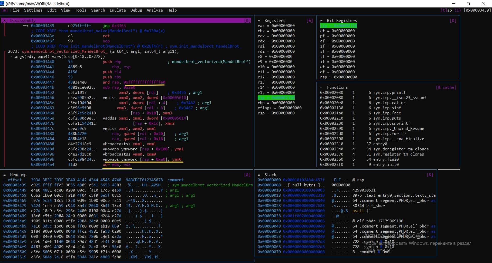

# Множество Мандельброта
## Описание проекта
В данном проекте было осуществлено сравнение различных алгоримтов построения множества Мандельброта (подробнее о нем ниже).

### Цель работы
Измерить скорость вычисления множества Мандельброта, используя 3 типа вычислений:
* "наивный" - вычисление, считающее цвет одного пикселя за одну итерацию цикла;
* "векторизированный" - оптимизация вычислений за счёт обработки нескольких точек одновременно
* SIMD-оптимизация (AVX2) — ускорение расчётов с использованием векторных инструкций процессора.

## Множество Мандельброта
Координаты точек множества Мандельброта удовлетворяют следующим уравнениям:
1) $x_{n+1}$ = $x_n^2 - y_n^2 + x_0$
2) $y_{n+1}$ = $2 \cdot x_n \cdot y_n + y_0$,

где $(x_0, y_0)$ - координаты рассчитываемого пикселя.  

Цвет пикселя изображения зависит от количества итераций (`MAX_ITERATIONS = 256`), при которых точка находится внутри окружности данного радиуса (`MAX_RADIUS = 10`). Важно отметить, что, если точка отдалилась от центра окружности на расстояние большее, чем ее радиус, то дальше она будет удаляться в "бесконечность" и красится в черный цвет.

  

Таким образом, можно легко отследить области, в которых точка не вышла за пределы окружности (не черный цвет) и наоборот (черный цвет).

## Особенности и запуск программы
### Режимы
В данном проекте отлажено два режима работы:
1) **Графический режим**: открывается графическое окно размером `800x600`, в котором визуализировано множество Мандельброта. В левом верхнем углу показывается FPS. Также поддерживается перемещение и изменение масштаба фигуры.
       
Горячие клавиши:
  
|   Клавиша   |   Действие    |
|------------:|:--------------|
| $\uparrow$    | Сдвиг вверх   |
| $\downarrow$  | Сдвиг вниз    |
| $\leftarrow$  | Сдвиг влево   |
| $\rightarrow$ | Сдвиг вправо  |
| $=$           | Приближение   |
| $-$           |  Удаление     |  

2) **Тестовый режим**: запускается цикл расчета `80` кадров. Полученное значение делиться на количество итераций (`80`). В стандартный вывод печатается затраченное время расчета одного кадра, либо в секундах, либо в тиках процессора
в зависимости от режима измерения, выбранного пользователем.
        
### Реализации
В программе реализованы три различных метода построения данного фрактала:
  - **Naive** - обработка отдельно каждого пикселя.
  - **Array** - обработка за 1 итерацию цикла массива из 8 пикселей.
  - **Simd**  - обработка за 1 итерацию цикла 8 пикселей c использованием AVX инструкций.

### Запуск
Для того, чтобы собрать и запустить проект, нужно ввести команду:
```bash
make
./mandle <opt>
``` 

Для того, чтобы запустить графическую реализацию нужно указать, какой метод построения вы хотите использовать (1 - `Naive`, 2 - `Array`, 3 - `Simd`).   
  
Для того, чтобы запустить тестовую реализацию нужно указать дополнительный аргумент командной строки, который отвечает за то, в чем вы хотите получить результат (0 - `seconds`, 1 - `ticks`).  

Пример запуска графической "наивной" реализации:
```bash
./mandle.exe 1  
``` 
Пример запуска тестовой "наивной" реализации с результатом в тиках процессора:
```bash
./mandle.exe 1 1
```
### Системные спецификации

Процессор: 12th Gen Intel(R) Core(TM) i5-1200H, 2500 МГц, 12 ядер, 16 логических процессоров.

Компилятор: gcc 13.3.0 & clang 18

ОC: Ubuntu WSL2

## Oбъяснение 
### Первая версия 
"Базовая версия" алгоритмов 

### Вторая версия 
Версия с увеличинным `VECTOR_SIZE` и мы посмотрим как на это реагирует компилятор

### Третия версия 
Версия где мы смотри как влияат на производительность выравнивание памяти. Также мы сравниваем два механизма выравнивания и вычисляем какой из них более эффективный

### Четвертая версия 
Версия где мы распараллериваем вычисления 

# Первая версия 
### Базовое вычисление множества Мандельброта
Измерение расчета 1 кадра мы будем получать в тактах процессора, используя функцию `__rdtsc()`. Данный метод является достаточно точным, поскольку `__rdtsc()` раскрывается в отдельную ассемблерную инструкцию (ее погрешность не превышает нескольких десятков тактов). Основную погрешность в измерения будут вносить прерывания, вызванные работой других процессов.   

Данные были получены для каждой версии алгоритма с каждым из уровней оптимизации:
 - **-O0**: оптимизация кода не производится. Исходный текст программы тривиальными преобразованиями перерабатывается в машинный код. Благодаря этому уменьшается время компиляции программы.
 - **-O3**: обычно применяются все доступные компилятору способы оптимизации.
 - **No flag**: также были получены данные при запуске программы без применения этих флагов.
  
### Обработка результатов
Для каждой серии измерений данные находятся в [таблице](data.md). Здесь будут усредненные значения, для нас они являются более важными.  


| Type\Flag       | No flags         | -O0           | -O3          |
|----------------:|:---------------:|:-------------:|:------------:|
| Naive on GCC    | $448.8\cdot10^6$    | $444.2\cdot10^6$  | $215.6\cdot10^6$ |
| Array on GCC    | $596.9\cdot10^6$    | $593.5\cdot10^6$  | $107.1\cdot10^6$ |
| Simd on GCC     | $186.6\cdot10^6$    | $188.5\cdot10^6$  | $32.9\cdot10^6$  |
|                 |                 |               |              |
| Naive on Clang  | $447.2\cdot10^6$    | $446.4\cdot10^6$  | $210.4\cdot10^6$ |
| Array on Clang  | $575.0\cdot10^6$    | $563.5\cdot10^6$  | $111.0\cdot10^6$ |
| Simd on Clang   | $182.4\cdot10^6$    | $183.9\cdot10^6$  | $31.8\cdot10^6$  |


Приведем так же таблицу лучших результаттов вычисления FPS для каждого метода 

| Implementation  | No flags (FPS) | -O0 (FPS)    | -O3 (FPS)    |
|----------------:|:-------------:|:-----------:|:-----------:|
| Naive on GCC    | 6.7           | 5.5         | 11.6        |
| Array on GCC    | 4.3           | 3.9         | 24.4        |
| SIMD on GCC     | 15.7          | 15.2        | 75.6        |
|                 |               |             |             |
| Naive on Clang  | 6.6           | 5.6         | 12.1        |
| Array on Clang  | 4.5           | 4.06        | 50.1        |
| SIMD on Clang   | 16.8          | 16.3        | 75.9        |


Для лучшего понимания визуализируем данные результаты с помощью гистограммы.

**On GCC** :
 

**On Clang**: 
 

## Результаты тестирования производительности базовой версии
### Ключевые наблюдения

1. **Эффективность оптимизации -O3**  
   Все методы вычислений демонстрируют значительное ускорение при компиляции с флагом `-O3`:  
   - Ускорение в **2.0-5.8?** по сравнению с `-O0`  
   - Наибольший прирост производительности наблюдается у SIMD on Clang (прирост производительности относительно No flags в 5.8 раз)
2. **Максимальная производительность (-O3)**  
   

| Метод           | Ускорение (-O3 vs -O0) |
|----------------:|:---------------------:|
| Naive on GCC    | +51.5%       |
| Array on GCC    | +82.0%       |
| SIMD on GCC     | +82.5%       |
|                 |              |
| Naive on Clang  | +52.9%       |
| Array on Clang  | +80.3%       |
| SIMD on Clang   | +82.7%       |
3. **Сравнение компиляторов**
   
   | Метод       | GCC (-O3) | Clang (-O3) | Разница |
   |-------------|----------|------------|---------|
   | Naive       | 215.5M   | 210.3M     | +2.5%   |
   | Vectorized  | 107.1M   | 111.0M     | -3.5%   |
   | SIMD        | 32.8M    | 31.8M      | +3.1%   |

   Clang показывает marginally лучшие результаты для SIMD (+3.1%), GCC лучше оптимизирует векторную версию.


### Почему без -O3 работает дольше?
Воспользуемся **Godbolt** и посмотрим, во что раскрывается функция c интринсиками с флагом -O3 и без него. Мы видим, что справа (версия без -O3) раскрывается в большое количество инструкций, а точнее использование `vmovaps`, так как задействуется меньшее количество регистров. А версия слева (версия с -O3) наоборот. Поэтому мы и получаем меньшее количество тактов процессора с флагом -O3.


# Вторая версия
## Оптимизация производительности через увеличение размера вектора

Изначально в проекте использовался размер вектора **8 элементов**, что соответствует:
- 256-битным регистрам AVX2 (ровно 8 float-значений)
- Естественному выравниванию для большинства SIMD-инструкций

**Наша задача — зарефакторить код так, чтобы компилятор увидел векторизацию**

**Проблема**: Компилятор (GCC/Clang) не применял агрессивные оптимизации, потому что:
```
float X0[8]; // Компилятор рассматривал как отдельный вектор
float X1[8]; // Без анализа межвекторных зависимостей
```

Эксперимент с ```VECTOR_SIZE = 32```

Вместо векторного сложения и умножения, разжуем компилятору сложения массивов независимыми циклами


| Implementation  | -O0               | -O3               | Ускорение (-O3 vs -O0) |
|----------------:|:-----------------:|:-----------------:|:----------------------:|
| **GCC**           |                    |                   |                        |
| Array           | $780.2 \cdot 10^6$ | $39.1 \cdot 10^6$  | +95.0%                |
| **Clang**         |                 |                   |                           |
| Array           | $851.7 \cdot 10^6$ | $91.6 \cdot 10^6$  | +89.2%                |


 
> [!NOTE]
> Чтобы можно было отслеживать где компилятор оптимизировал код, то можно воспользоваться флагом ```-fopt-info-vec``` для **GCC**, а для **Clang** ```-Rpass=vectorize```


## Промежеточный результат 
**GCC** 
  - Array при флаге O0 производительость ухушилась в 0.7 раз, НО при флаге O3 скорость выросла в 2.7 раз

**Clang**
  - Array при флаге O0 производительность ухудшилась в 0.7 раз, НО при флаге O3 скорость выросла в 1.2 раза


**Примечание**

Все резальтаты сравнивалиь с первой версией

## Почему так получилось ? 


**[VECTOR_SIZE = 8](https://godbolt.org/z/44b4zPed6)** - скалярная версия
 


**[VECTOR_SIZE = 32](https://godbolt.org/z/P7Eq8K41r)** -  векторная AVX-оптимизированная версия


> [!Important] 
> Подсказки соотносятся только к 'своим' картинка.

### 1. Использование векторных инструкций

**VECTOR_SIZE=8:**
- Использует 128-битные SSE-инструкции (xmm-регистры)
- Обрабатывает 4 float-значения одновременно (желтым подчеркнул)
- В реальности работает с отдельными скалярными значениями (подчеркнул красным)

**VECTOR_SIZE=32:**
- Использует 256-битные AVX-инструкции (ymm-регистры)
- Обрабатывает 8 float-значений одновременно (подчеркнуто жёлтым)
- Полностью векторизованные операции

### 2. Организация циклов

**VECTOR_SIZE=8:**
- Внутренние циклы не развернуты 
- Много условных переходов внутри горячих циклов
- Частые обращения к памяти

**VECTOR_SIZE=32:**
- Циклы развернуты и оптимизированы  (разные части данных обрабатываются в параллельных блоках. к примеру .L4)
- Минимизированы условные переходы (используются битовые маски)
- Данные остаются в регистрах дольше

### 3. Использование регистров

**VECTOR_SIZE=8:**
- Неэффективное использование регистрового пространства (частые сохранения в стек)
- Частые сохранения/загрузки из стека

**VECTOR_SIZE=32:**
- Оптимальное распределение данных по регистрам  (подчеркнул зеленым: загружаем сразу по 8 регситров )
- Широкие регистры ymm позволяют обрабатывать больше данных за инструкцию


### Вывод по этой версии


Основной выигрыш в производительности достигается за счет:
1. Оптимизации работы с памятью
2. Уменьшения накладных расходов на управление циклами
3. Более эффективного использования регистрового пространства
 
# Третия версия 
Сравним два механизма выравнивая `alignas` и `aligned_alloс` и выберем тот, который показывает лучшиии результаты


Вот программа в которой лежит код с выравниваем [```mandelbrot_alignment.cpp```](https://github.com/MaxGud10/Mandelbrot/blob/main/src/mandel_alig.cpp)


**Резульаты тестирования**

### Alignas

| Implementation | -O0               | -O3               | Ускорение (-O3 vs -O0) |
|----------------|-------------------|-------------------|-------------------------|
|                         **GCC**                           |
| Array          | $541.9 \cdot 10^6$  | $75.6 \cdot 10^6$   | +71.6%                 |
| SIMD           | $166.6 \cdot 10^6$  | $32.9 \cdot 10^6$   | +60.2%                 |
| **Clang**                       |
| Array          | $559.3 \cdot 10^6$  | $60.8 \cdot 10^6$   | +91.9%                 |
| SIMD           | $158.1 \cdot 10^6$  | $30.8 \cdot 10^6$   | +51.8%                 |


| Тип реализации | Компилятор | -O0 (FPS) | -O3 (FPS) | Ускорение (-O3/-O0) |
|----------------|------------|----------|----------|---------------------|
| Array           | GCC        | 4.6     | 31.6     | 6.9x               |
| SIMD            | GCC        | 15.7     | 74.7     | 4.8x               |
|                 |            |          |          |
| Array           | Clang      | 3.7     | 42.4    | 11.5x                |
| SIMD            | Clang      | 16.5     | 76.5    | 4.6x                |

**mandelbrot_vectorized**

Жёлтым показал, что память в фукции `mandelbrot_vectorized` выровнена 

**mandelbrot_simd**

Красным показал примеры, что память [выровнена](https://godbolt.org/z/4EqYcasbq) 

### Aligned_alloс

| Implementation  | -O0               | -O3               | Ускорение (-O3 vs -O0) |
|----------------:|:-----------------:|:-----------------:|:----------------------:|
| **GCC**           |                    |                   |                        |
| Array           | $831.9 \cdot 10^6$ | $77.1 \cdot 10^6$  | +107.8%                |
| Simd           | $171.2 \cdot 10^6$ | $ 34.6 \cdot 10^6$|+49.5%|
|                |                     |                   |
**Clang**         |                 |                   |                           |
| Array           | $843.9 \cdot 10^6$ | $63.6 \cdot 10^6$  | +132.7%                |
| Simd           | $157.2 \cdot 10^6$ | $ 32.6 \cdot 10^6$|+48.2%|

| Тип реализации | Компилятор | -O0 (FPS) | -O3 (FPS) | Ускорение (-O3/-O0) |
|----------------|------------|----------|----------|---------------------|
| Array           | GCC        | 3.1     | 33.2     | 10.7x                |
| SIMD            | GCC        | 14.4     | 72.6     | 5.0x                |
|                 |            |          |          |
| Array           | Clang      | 2.9     | 39.6    | 13.6x                |
| SIMD            | Clang      | 16.3     | 73.7   | 4.5x                |


**mandelbrot_vectorized**

Жёлтым показал, что память в фукции `mandelbrot_vectorized` выровнена

**mandelbrot_simd**

Красным показал примеры, что память [выровнена](https://godbolt.org/z/jTv6qjah3)

## Сравнительный анализ

### Коэффициент ускорения (-O3/-O0)
| Метод          | Array (GCC) | SIMD (GCC) | Array (Clang) | SIMD (Clang) |
|----------------|------------|------------|--------------|--------------|
| `alignas`      | 6.9x       | 4.8x       | 11.5x        | 4.6x         |
| `aligned_alloc`| 10.7x      | 5.0x       | 13.6x        | 4.5x         |

Хоть и коэффициенты скорения у `aligned_alloc` даже больше чем у `alignas`, но скорость высчитывания множества Мандельброта у `alignas` выше. Давайте разберемся почему:

### Почему `alignas` быстрее:

1. **Локальность данных**  
   - Использует стек $\rightarrow$ данные ближе к CPU (меньше cache misses)
   - Не требует системных вызовов для выделения памяти

2. **Оптимизации компилятора**  
   - Позволяет агрессивное развертывание циклов (есть loop unrolling)
   - Лучше интегрируется с SIMD-инструкциями

3. **Отсутствие накладных расходов**  
   - Не нужны дополнительные проверки границ
   - Нет фрагментации памяти

### Проблемы `aligned_alloc`:

1. **Heap-аллокации**  
   - Медленнее стека на 10-30%
   - Дополнительные накладные расходы на malloc/free

2. **Сложность управления**  
   - Риск утечек памяти без proper free
   - Может вызывать фрагментацию при частых аллокациях

### Вывод

**Для максимальной производительности**:
   - Используйте `alignas` везде, где возможно
   - Особенно эффективен для:
     - Временных SIMD-буферов
     - Небольших фиксированных массивов
     - Локальных переменных в hot loops

# Четвертая версия
## Многопоточная реализация

### Ожидаемый прирост

Современные процессоры поддерживают технологию гиперпоточности (Hyper-Threading у Intel или SMT у AMD), которая позволяет одному физическому ядру выполнять сразу два программных потока.

Основная идея гиперпоточности заключается в более эффективном использовании вычислительных ресурсов: пока один поток ждёт данные из памяти или по какой-то иной причине простаивает, второй поток может использовать свободные вычислительные блоки ядра

При полной загрузке процессора гиперпоточность может обеспечить дополнительное ускорение порядка 20–30% по сравнению с использованием только физических ядер (x7-8 в нашем случае). Но стоит готовиться к худшему — в нашем случае, когда узким местом являются арифметические операции, прирост может оказаться ниже, чем для задач, где часто возникают ожидания.

## Использование OpenMD

> [!NOTE]
> OpenMP (Open Multi-Processing) — открытый стандарт для распараллеливания программ. Даёт описание совокупности директив компилятора (#pragma ...), библиотечных процедур и переменных окружения, которые предназначены для программирования многопоточных приложений на многопроцессорных системах с общей памятью.

## Простейший способ распараллеливания
**OpenMP** предлагает минималистичный подход - достаточно одной директивы:

```
    #pragma omp parallel for
    for (size_t y = 0; y < HEIGHT; y++) 
    {
        const float base_x0 = (-(HALF_WIDTH) * D_X + set->x_offset) * set->scale;
    . . . 
```

## Критически важные условия

**Независимость итераций** - ключевое требование:
  - Ранее c_y вычислялась через инкремент (зависимость между итерациями)
  - Новая версия вычисляет координату автономно для каждого Y

## Основные типы распределения итераций

### 1. `Статическое`
- **Принцип работы**:  
  - Цикл автоматически делится на блоки (чанки)
  - Все потоки завершают работу до продолжения основной программы
- **Преимущества**:
   - Нулевые накладные расходы на планирование
   - Идеально для циклов с постоянным временем итерации
- **Недостатки**:
   - Только для циклов с известным числом итераций
   - Жесткий синтаксис (нельзя использовать с while)

### 2. `Динамическое`
- **Особенности**:  
  - Фиксированный размер чанка = N итераций
  - Потоки получают блоки по 8 итераций
- **Оптимальное применение**:
    - Когда время выполнения итераций примерно одинаково  
    - Уменьшает накладные расходы vs `dynamic`  

### 3. `Guided`
- **Гибридный алгоритм**:  
  - Начинает с крупных блоков ? уменьшает размер по мере выполнения
  - Минимальный размер чанка = 8 (последние блоки)
- **Преимущества**:  
  - Быстрый старт (крупные блоки)  
  - Хорошая балансировка (мелкие блоки в конце)  

## Результаты 

| Type\Flag       | Array        |   SIMD     | 
|----------------:|:------------:|:----------:|
|Static            | $36,0 \cdot 10^6$    | $29.2 \cdot 10^6$  |
|Dynamic, N        | $38,6 \cdot 10^6$   | $9.3 \cdot 10^6$    | 
|Guided,  N        | $35,9 \cdot 10^6$   | $8,7 \cdot 10^6$    |  

| Режим распараллеливания | Array FPS | SIMD FPS | 
|-------------------------|----------------------|---------------------------|
| static                  | 167              |189                                         |
| dynamic, N           | 245               | 376                                      |
| guided, N             | 249              |      388                               |

Мы получили ускорение в 21.7 раз относительно своих версий на O0 без применения OpenMD, а значит, гиперпоточность дала нам дополнительные неплохой такой прирост производительности 

# Что делает директивы в этом коде
В учебных целях разбиремся что же под копотом у методов планирования 

## Анализ работы `#pragma omp parallel for` [в ассемблерном коде](https://godbolt.org/z/oxdYhP5vs)


### Параллельное выполнение внешнего цикла
```asm
.L13:                         ; начало параллельного региона
   vcvtsi2ss xmm1, xmm5, rdi  ; преобразование y в float
   ...
   add rdi, 1
   cmp rdi, 600
   jne .L13                    ; конец параллельного региона
```
- Разделение итераций: Каждый поток получает свой диапазон значений y (0-599)
- Автоматическая синхронизация: Неявный барьер после завершения всех итераций

### Распределение регистров
```
vmovaps ymm15, YMMWORD PTR [rsp+40]  ; загрузка в регистр
vmovaps YMMWORD PTR [rsp+392], ymm14 ; сохранение из регистра
```
- Оптимальное использование 16 YMM-регистров
- Минимизация обращений к памяти

### Параллельный доступ к памяти
```
mov DWORD PTR [rsi+rax*4], edx  
```
- Каждый поток работает со своим участком массива pixels_array
- Отсутствие коллизий при записи

## Анализ работы `#pragma omp parallel for schedule(dinamic, N)` [в ассемблерном коде](https://godbolt.org/z/KKhsGPG1W)

### Динамическое распределение работы
```
.L13:                  ; Начало параллельного региона
   ; ... вычисления ...
   add rdi, 1
   cmp rdi, 600
   jne .L13
```
Директива преобразует этот цикл так, что:

  - Итерации разбиваются на блоки по 8 (chunk size=8)

  - Потоки динамически получают новые блоки по мере завершения

### Особенности реализации dynamic schedule

***Локализация данных:***
```
sub rsp, 904  ; каждый поток имеет свой стековый фрейм
```
Это позволяет потокам работать независимо

## Анализ работы `#pragma omp parallel for schedule(guided, N)` [в ассемблерном коде](https://godbolt.org/z/rMnh6Esrv)

### Guided Scheduling в действии
```
.L13:  ; Главный параллельный цикл
   add rdi, 1
   cmp rdi, 600
   jne .L13
```
- Размер блоков уменьшается экспоненциально до минимального (8 итераций)
- Начальный размер блока = (общее_число_итераций)/(число_потоков)


Адаптивные чанки:
  - Первые потоки получают крупные блоки (для быстрого старта)
  - Последние блоки фиксированного размера (8 строк изображения)

# Заключение 

## Сравним версии без оптимизации с уже оптимизированными версиями

| Реализация               | Результат (Ticks $\cdot10^6$) | Прирост (O3 vs O0) |
|--------------------------|-----------------------:|-------------------:|
| **Базовые реализации**   |                        |                    |
| Naive                    | 210.4                 | 2.1x               |
| Array (ручная)           | 107.1                 | 5.7x               |
| SIMD (ручная)            | 31.8                  | 5.8x               |
| **Оптимизированные**     |                        |                    |
| Array enlarged           | 39.1                  | 15.0x              |
| Array с выравниванием    | 60.8                  | 9.8x               |
| SIMD с выравниванием     | 30.8                  | 6.1x               |
| **Многопоточные**        |                        |                    |
| Static schedule          | 29.2                  | 6.5x               |
| Dynamic schedule         | 35.9                  | 5.2x               |
| Guided schedule          | 8.7                   | 21.6x              |
